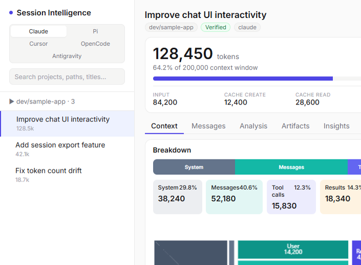

# Agent Session Intelligence

[](./LICENSE)
[](https://github.com/ZoheerAlmansoub/agent-session-intelligence/actions/workflows/ci.yml)

Local-first web app to **visualize and analyze agent sessions** from Claude Code, Cursor, Pi, and OpenCode: context token breakdown, LLM-powered insights, governance pipelines, and skills/rules generation.

> **الدليل العربي:** [docs/GUIDE-ar.md](./docs/GUIDE-ar.md)

Session data stays on your machine. Nothing is uploaded except LLM API calls you configure for Analysis and Governance.



**Supported transcript sources:**

- **Claude Code:** `~/.claude/projects/**/*.jsonl`
- **Pi:** `~/.pi/agent/sessions/**/*.jsonl`
- **Cursor:** `~/.cursor/projects/*/agent-transcripts/*/*.jsonl`
- **OpenCode:** `~/.local/share/opencode/opencode.db` (SQLite) or legacy JSON storage

---

## Quick start

**Requirements:** [Bun](https://bun.sh)

```sh
git clone https://github.com/ZoheerAlmansoub/agent-session-intelligence.git
cd agent-session-intelligence
bun install && cd web && bun install && cd ..
cp .env.example .env   # optional — for Analysis tab
bun run dev
```

| Platform | Command |
|----------|---------|
| Windows | `.\start.ps1` |
| API + UI | http://localhost:5174 · http://localhost:5173 |

```sh
bun run hooks:install   # optional pre-commit secret scan
bun test                # run unit tests
```

---

## Features

### Context

Treemap, sunburst, and bar charts with drill-down into user messages, tool calls, tool results, attachments, and thinking. Headline stats for input/output, cache read/write, and compaction boundaries.

### Messages

Chronological user messages with turn numbers. Copy one or all. Post-compaction filter.

### Analysis (LLM)

19 analysis types across six categories — token audit, loop diagnosis, compaction recovery, artifact blueprints, memory drafts, and more. **Analysis Pipeline Wizard** with optional Apply Pack.

Configure providers in `.env` or **Settings → LLM** (live reload, saved locally in `.cache/`).

### Governance

Session and project pipelines (Quick / Standard / Full). Reads `AGENTS.md`, `CLAUDE.md`, rules, and skills from disk. Background runs with cancel/resume. Export playbook to `docs/governance/`.

### Artifacts & Insights

Generate skills, rules, hooks, and sub-agent specs. Detect retry loops, tool errors, and token waste across sessions.

---

## LLM providers

Anthropic · OpenAI · OpenRouter · OpenCode Zen · Groq · DeepSeek · Ollama · NVIDIA NIM

See [.env.example](./.env.example) for configuration.

---

## Security

Never commit API keys. Use `.env` locally or in-app settings.

```sh
bun run check:secrets
```

Details: [SECURITY.md](./SECURITY.md)

---

## API

| Route | Description |
|-------|-------------|
| `GET /api/health` | Health check |
| `GET /api/sessions/:id/transcript` | Full transcript |
| `POST /api/sessions/:id/analyze` | LLM analysis |
| `POST /api/sessions/:id/govern` | Session governance |
| `POST /api/projects/:slug/govern` | Project governance |
| `GET /api/config/llm` | Provider config (no secrets) |

Full reference: [docs/AGENT-INTELLIGENCE-ROADMAP.md](./docs/AGENT-INTELLIGENCE-ROADMAP.md)

---

## Project structure

```
server/   Bun API, transcript engine, LLM, governance
web/      React + Vite UI
docs/     Roadmap, Arabic guide
scripts/  Tests, secret scanning
```

---

## Contributing

Contributions welcome — bug reports, transcript parsers, analysis improvements, and docs.

- [CONTRIBUTING.md](./CONTRIBUTING.md)
- [CODE_OF_CONDUCT.md](./CODE_OF_CONDUCT.md)
- [CHANGELOG.md](./CHANGELOG.md)

---

## License

[GPL-3.0-or-later](./LICENSE)
